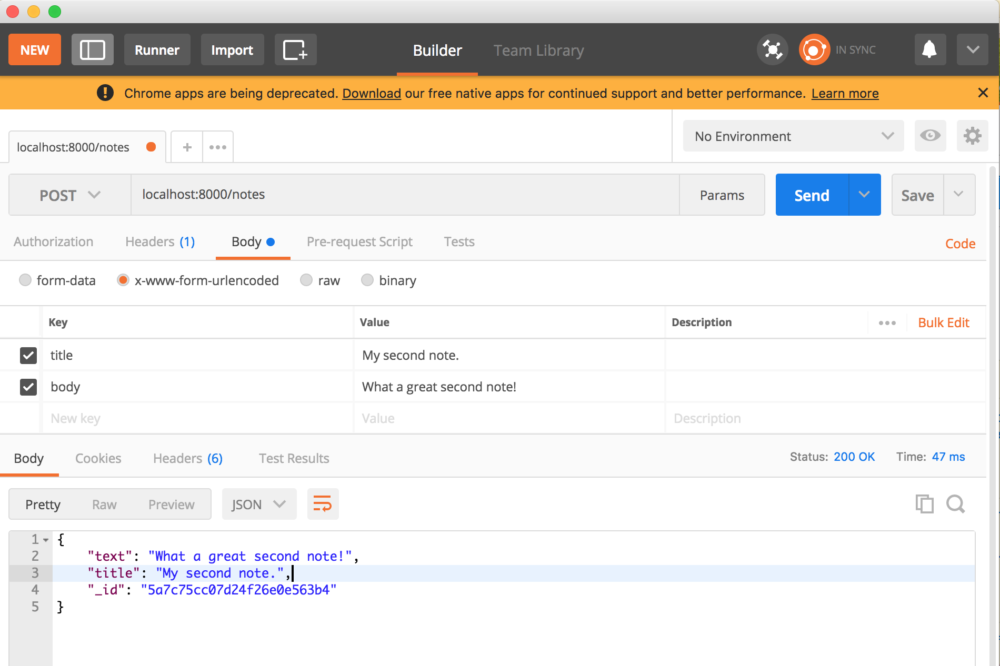

Project is based off of this 30 minute [Youtube Tutorial](https://www.youtube.com/watch?v=fsCjFHuMXj0&t=13s) by FreeCodeCamp

The goal of this tutorial is to give you a degree of familiarity with Express, Node and MongoDB.

